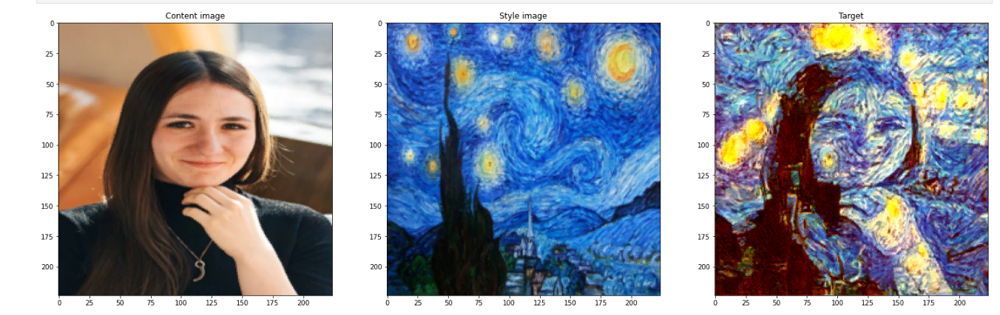

# StyleTransfer
Style transfer with pretrained VGG19 network on PyTorch.

## Getting started

Download styleTransfer.ipynb and go through it step by step. All you need to get stylized picture is original picture and sytle picture, resulted picture size will be 224 * 224. 

## Versions of main used libraries
| Library | Version |
| :--- | :---: |
| python | 3.9.16 | 
| torch | 1.13.1+cu117 |
| torchvision | 0.14.1 |
| torchsummary | 1.5.1 |
| matplotlib | 3.3.3 |
| numpy | 1.24.2 |
| pillow | 9.5.0 |

## Results
*Example to illustrate style transfer*

## Useful links

1. [A Neural Algorithm of Artistic Style](https://arxiv.org/abs/1508.06576)
1. [How to Get Beautiful Results with Neural Style Transfer](https://towardsdatascience.com/how-to-get-beautiful-results-with-neural-style-transfer-75d0c05d6489)
1. [Artistic Neural Style Transfer using PyTorch](https://www.kaggle.com/code/soumya044/artistic-neural-style-transfer-using-pytorch)
1. [Feature Visualization](https://distill.pub/2017/feature-visualization/)

## Feedback

:lady_beetle: If you found any kind of errors or typos in this project please let me know :vulcan_salute: